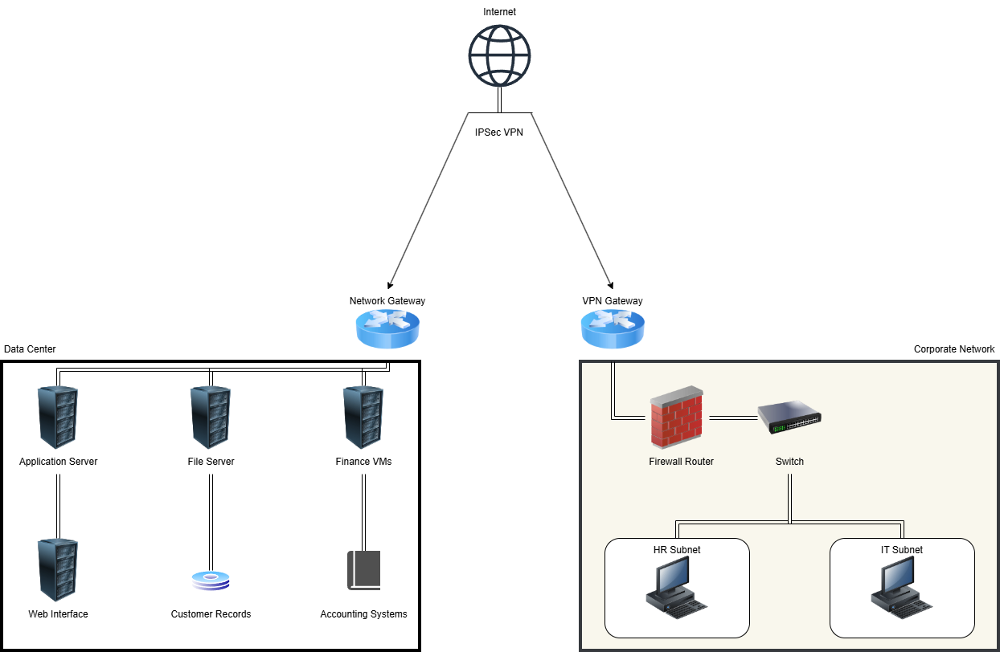

# financial-app-security-assessment

## Overview
This project documents a security risk assessment and mitigation strategy for a fictional financial web application environment.

The assessment identifies potential threats, evaluates risk levels, and proposes security controls aligned with industry frameworks such as the NIST Cybersecurity Framework.

## System Architecture

## Objectives

• Identify security vulnerabilities within the system architecture  
• Evaluate risks based on likelihood and impact  
• Recommend security controls to mitigate threats  
• Develop monitoring and incident detection strategies  

## Project Components

Risk Assessment  
Threat Modeling  
Security Architecture Controls  
Monitoring and Detection Strategy  

## Tools and Frameworks Referenced

NIST Cybersecurity Framework  
STRIDE Threat Modeling  
SIEM Monitoring Concepts  

## Repository Structure

risk-assessment.md  
threat-model.md  
security-controls.md  
monitoring-strategy.md  

## Author

Mitchell G
Cybersecurity Student | Blue Team Focus
